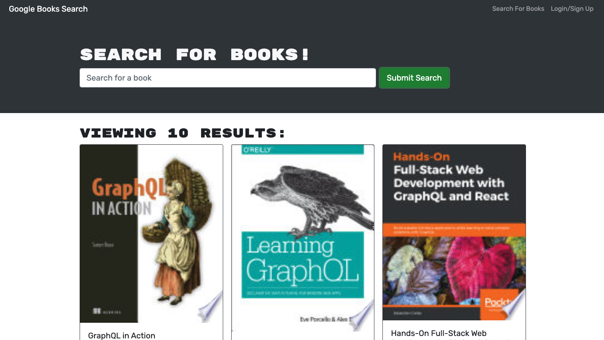

# Book Search Engine

## Description

Refactoring exercise wherein a simple search engine's RESTful API was replaced with an equivalent GraphQL API. The search engine originally provided was a full-stack MERN app, featuring the ability to search and save books to a personal profile using the Google Books API. JWT-based authentication was implemented for users, and database interactions were facilitated by REST endpoints. After refactoring, the project includes the following features in accordance with the challenge guidelines:
- Use of `Apollo Server` to replace the REST endpoints with a GraphQL interface:
  - Creation of `typeDefs` and `resolvers` to define a GraphQL schema for front-end interaction.
  - Refactoring of authentication middleware to work with Apollo Server, rather than Express endpoints.
- Use of `Apollo Client` to replace the REST API calls from the front end with an approach based on React hooks.
  - Addition of an `ApolloProvider` in the main app file to enable connection from all app components to the Apollo Server instance on the back end.
  - Creation of client-side definitions for `queries` and `mutations` written in GraphQL.
  - Use of `useQuery` and `useMutation` hooks to enable CRUD interactions with the database.
  - Use and proper updating of Apollo's in-memory cache so that page reloads are not necessary after database updates.

## Usage

A deployed instance of the app is available [here on Heroku](https://binderb-booksearch.herokuapp.com/).

## Credits

This project is designed to showcase the developer's ability to refactor an existing project to use a different API solution. A functional, REST-based starter project was therefore provided by the UofM Coding Bootcamp (Trilogy Education Services), while the refactored portions (detailed above) were written by the developer.

## License

Please refer to the LICENSE in the repo.